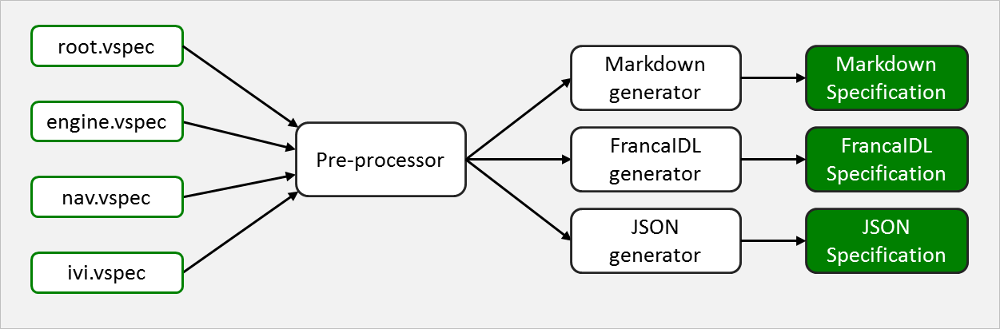

**(C) 2016 Jaguar Land Rover - All rights reserved.**<br>

All documents in this repository are licensed under the Creative
Commons Attribution 4.0 International (CC BY 4.0). Click
[here](https://creativecommons.org/licenses/by/4.0/) for details.
All code in this repository is licensed under Mozilla Public License
v2 (MPLv2). Click [here](https://www.mozilla.org/en-US/MPL/2.0/) for
details.

# VEHICLE SIGNAL SPECIFICATION
This repository specifies a set of vehicle signals that can be used in
automotive applications to communicate the state of various vehicle
systems.

The collection of signal specifications, or simply signals, is vendor
independent. Vendor-specific extensions can be specified in a dedicated and
uncontrolled branch of the signal specification tree. 

The format of the directories and signal specification files is aimed
at allowing easy, git-based management with branching, merging, and
release. With this in mind, the signal specification can be broken up
into smaller files that can be edited and re-used while minimizing
merge conflicts.

A released signal specification can be used, together with tools in
this repository, to automatically generate a number of different
target specification formats, such as JSON, FrancaIDL, markdown, etc.

Below is a schematic showing the top-level provess.

<br>
*Fig 1. Generating documents from specification*


The tools are available in a separate [repository].(https://github.com/PDXostc/vehicle_signal_tools)

The release management process will be driven in the context of GENIVI
and its Remote Vehicle Interaction expert group.


# SIGNAL DEFINITION

A signal is a named entity, such as rpm, that at any time can have a
value, such as 3400.

Signals are organized into a tree such as outlined below.

<br>
*Fig 2. A signal tree example*

## <a name="signal-type"/>SIGNAL TYPE
Each signal specifies a type from the following set (from FrancaIDL):

Name       | Type                       | Min  | Max 
:----------|:---------------------------|:-----|:---
UInt8      | unsigned 8-bit integer     | 0    | 255
Int8       | signed 8-bit integer       | -128 | 127
UInt16     | unsigned 16-bit integer    |  0   | 65535 
Int16      | signed 16-bit integer      | -32768 | 32767
UInt32     | unsigned 32-bit integer    | 0 | 4294967295
Int32      | signed 32-bit integer      | -2147483648 | 2147483647
UInt64     | unsigned 64-bit integer    | 0    | 2^64
Int64      | signed 64-bit integer      | -2^63 | 2^63 - 1
Boolean    | boolean value              | 0/false | 1/true
Float      | floating point number      | -3.4e -38 | 3.4e 38
Double     | double precision floating point number | -1.7e -300 | 1.7e 300
String     | character string           | n/a  | n/a
ByteBuffer | buffer of bytes (aka BLOB) | n/a | n/a

Please note that the special type ```branch``` denotes a branch, not a
signal. See [branch entry](#branch-entry) chapter for details.


## SIGNAL RANGE [OPTIONAL]
A signal can optionally be specified with a min and max limit,
defining a range that the signal can assume a value within.

## SIGNAL ENUMERATION [OPTIONAL]
A signal can optionally be specified with a set of allowed values that
the signal can be assigned, effectively turning it into an enumerator.  The
values are of the same type as the signal itself.

## <a name="signal-unit-of-measurment"/>SIGNAL UNIT OF MEASUREMENT [OPTIONAL]
A signal can optionally specify a unit type from the following set:

Unit type  | Domain      | Description
:----------|:------------|:-------------
kph        | Speed       | Kilometers per hour
celsius    | Temperature | Degrees Celsius
mbar       | Pressure    | millibar
percent    | Percent     | Percent
hz         | frequency   | Frequency
lat        | position    | Decimal latitude 
lon        | position    | Decimal longitude
millimeter | distance    | Millimeter
meter      | distance    | Meter
kilometer  | distance    | Kilometer
rpm        | frequeucy   | Rotations per minute.
kw         | power       | Kilowatt
kwh        | power       | Kilowatt hours
gr/sec     | flow        | Grams per second
[more to come] | ... | ...


## SIGNAL NAMING CONVENTION
Signals are named, left-to-right, from the root of the signal tree
toward the signal itself. Each element in the name is delimited with
a period (".") .

In Fig 1 above the left mirror heated signal would be:

    body.mirrors.left.heated


If there are an array of elements, such as door 0 - 3, they will be
named with an index branch:

```
body.doors.0.lock
body.doors.0.windows_pos
body.doors.1.lock
body.doors.1.windows_pos
body.doors.2.lock
body.doors.2.windows_pos
body.doors.3.lock
body.doors.3.windows_pos
```


### PARENT NODES
If a signal is defined, all parent branches included in its name must
be included as well, as shown below:

```
[Signal] body.mirrors.left.heated
[Branch] body.mirrors.left
[Branch] body.mirrors
[Branch] body
```

The branches do not have to be defined in any specific order as long
as each branch component is defined somewhere in the vspec file (or an
included vspec file).


# SIGNAL SPECIFICATION FORMAT
The signal specification is written in JSON format, where each signal
is a self-contained JSON object.

One or more JSON objects are aggregated into a single file, called a
*vspec* file.

A vspec can, in addition to JSON objects, also contain comments and
include directives.

An include directive refers to another vspec file that is to replace
the directive, much like ```#include``` in C/C++.

The schematics below shows an example of a top-level
file ```root.vspec``` that includes two other
files, ```body.vspec``` and ```chassis.vspec```. In
its turn ```chassis.vspec``` includes ```brakes.vspec```


## <a name="branch-entry"/>BRANCH ENTRY
A branch entry describes a tree branch (or node) containing other branches and signals.

A branch entry example is given below

```
{
  "name": "body.door",
  "type": "branch",
  "aggregate": true,
  "description": "Some description"
}
```

The following elements are defined:

* **```name```**<br>
Defines the dot-notaded signal name to the signal. Please note that
all parental branches included in the name must be defined as well.

* **```type```**<br>
The value ```branch``` specifies that this is a branch entry (as
opposed to a signal entry).

* **```aggregate``` [optional]**<br>
Defines if this branch is an aggreaget or not. See
[aggregate branch](#aggregate-branch) chapter for more information.<br>
Defaults to ```false``` if not defined.

* **```description```**<br>
A description string to be included (when applicable) in the various
specification files generated from this branch entry.


## SIGNAL ENTRY
A signal entry defines a single signal and its attributes. A signal
entry example is given below.

```
{
	"name": "chassis.transmission.speed",
	"type": "Uint16",
	"unit": "km/h",
	"min": "1",
	"max": "300",
	"description": "The vehicle speed, as measured by the drivetrain."
}
```

* **```name```**<br>
Defines the dot-notaded signal name to the signal. Please note that
all parental branches included in the name must be defined as well.

* **```type```**<br>
The string value of the type specifies the scalar type of the signal
value. See [signal type](#signal-type) chapter for a list of available types.

* **```min``` [optional]**<br>
The minimum value, within the interval of the given ```type```, that
the signal can be assigned.<br>
If set to ```false```, the minimum value will be the "Min" value for
the given type.
chapter.<br>
Default, if not specified, is ```false```.<br>
Cannot be specified if ```enum``` is specified for the same signal entry.

* **```max``` [optional]**<br>
The max value, within the interval of the given ```type```, that the
signal can be assigned.<br>
If set to ```false```, the maximum value will be the "Max" value for
the given type.
chapter.<br>
Default, if not specified, is ```false```.<br>
Cannot be specified if ```enum``` is specified for the same signal entry.


* **```unit``` [optional]**<br>
The unit of measurement that the signal has.e. See
[signal unit of measurements](#signal-unit-of-measurement) chapter for
a list of available unit types.<br>
Cannot be specified if ```enum``` is specified for the same signal entry.

* **```description```**<br>
A description string to be included (when applicable) in the various
specification files generated from this signal entry.


## ENUMERATED SIGNAL ENTRY
A signal can optionally be enumerated, allowing it to be assigned a value from a
specified set of values. An example of an enumerated signal is given below.

```
{
	"name": "chassis.transmission.gear",
	"type": "Uint16",
	"enum": [ -1, 1, 2, 3, 4, 5, 6, 7, 8 ],
	"description": "The selected gear. -1 is reverse."
}
```

An enumerated signal entry has no ```min```, ```max```, or ```unit```
element.

The ```enum``` element is an array of values, all of the type specified
by ```type``` element, that the signal can be assigned.


## <a name="aggregate-branch"/>AGGREGATE BRAMCH
A branch entry's ```aggregate``` set to ```true``` indicates that any
updated signal hosted under the given branch should be distributed
together with all other signals hosted under the same branch, even if
the latter have not changed their values.

This allows for records containing multiple signals to be distributed
as an atomic unit by the Vehicle Signal Interface and other systems.

Below is an example a complete specification describing a geospatial position.

```
{
  "name": "nav",
  "type": "branch",
  "description": "Navigational top-level branch."
}

{
  "name": "nav.location",
  "type": "branch",
  "aggregate": true,
  "description": "The current location of the vehicle."
}

{
  "name": "nav.location.lat",
  "type": "Float",
  "description": "Latitude."
}

{
  "name": "nav.location.lon",
  "type": "Float",
  "description": "Latitude."
}

{
  "name": "nav.location.alt",
  "type": "Float",
  "description": "Altitude."
}
```

The ```nav.location``` branch's ```aggregate``` member indicates that
if any of ```lat```, ```lon```, or ```alt``` are are assiged a new
value, all three signals should be distrubuted as a single entity.


# VSPEC FILE FORMAT
Apart from JSON objects, a vspec file can have two additional
elements, comments and include directives, described below


## COMMENT
A comment starts with a ```#``` and extends to the end of the line.
If a ```#``` is encountered as a part of a line, all characters
after ```#``` are ignored.


Below is an example of a signal entry with comments.

```
# This will be ignored
{
	"name": "chassis.transmission.speed",
	"type": "Uint16", # This will also be ignored
	"unit": "km/h",
	"min": "1",
	"max": "300",
	"description": "The vehicle speed, as measured by the drivetrain."
}
```


## INCLUDE DIRECTIVE

An include directive in a vspec file will read the file it refers to
and insert it into the location of the directive. The included file
will, in its turn, be scanned for include directives to be replaced,
effectively forming a tree of included files.

See below for an example of such a tree.

**INSERT SCHEMATICS HERE**

The include directive has the following format.

    #include <filename>,[prefix]

The ```<filename>``` part specifies the path, relative to the file with the ```#include``` directive, to the vspec file to replace the directive with. The filename is enclused in double quotes (```"```).

The optional ```[prefix]``` specifies a branch name to be
prepended to all signal entries in the included file. This allows a vspec file
to be reused multiple times by different files, each file specifying their
own branch to attach the inlcuded file to.

An example of an include directive is given below.

    #include "doors.vpsec","chassis.doors"

The ```"door.vspec"``` section specifies the file to include.

The ```"chassis.doors"``` section specifies that all signal entries in
```door.vspec``` should have their names prefixed with ```chassis.doors```.


If an included vspec file has branch or signal specifications that
have already been defined prior to the included file, the new
specifications in the included file will replace the previoius
specifications.

Below is an example of two files, ```root.vspec```, and ```door.vspec```.


```
#
# root.vspec
#
{
  "name": "chassis",
  "type": "branch",
  "description": "All things chassis."
}

{
  "name": "chassis.doors",
  "type": "branch",
  "description": "All doors."
}

{
  "name": "chassis.doors.left_front",
  "type": "branch",
  "description": "Left front door."
}

{
  "name": "chassis.doors.right_front",
  "type": "branch",
  "description": "Right front door."
}

{
  "name": "chassis.doors.left_rear",
  "type": "branch",
  "description": "Left rear door."
}

{
  "name": "chassis.doors.right_rear",
  "type": "branch",
  "description": "Right rear door."
}

#
# Include door.vspec four times, once
# for each door branch specified above.
#

#include "door.vspec","chassis.doors.left_front"
#include "door.vspec","chassis.doors.right_front"
#include "door.vspec","chassis.doors.left_rear"
#include "door.vspec","chassis.doors.right_rear"
```


```
#
# door.vspec
#
{
	"name": "lock",
	"type": "Boolean",
	"description": "Indicates if the door is locaked (true), or not (false)."
}

{
	"name": "window_pos",
	"type": "Uint8",
	"unit": "percent",
	"min": 0,
	"max": 100,
	"description": "Indicates the window position. 0 = closed. 100 = open"
}
```


The two files above, once the ```#include``` directives have been
processed, will have the following specification.

```
{
  "name": "chassis",
  "type": "branch",
  "description": "All things chassis."
}

{
  "name": "chassis.doors",
  "type": "branch",
  "description": "All doors."
}

{
  "name": "chassis.doors.left_front",
  "type": "branch",
  "description": "Left front door."
}

{
  "name": "chassis.doors.right_front",
  "type": "branch",
  "description": "Right front door."
}

{
  "name": "chassis.doors.left_rear",
  "type": "branch",
  "description": "Left rear door."
}

{
  "name": "chassis.doors.right_rear",
  "type": "branch",
  "description": "Right rear door."
}

#
# Include directive is replaced with file content and updated
# signal names.
#


#
# Left front door
#
{
	"name": "chassis.doors.left_front.lock",
	"type": "Boolean",
	"description": "Indicates if the door is locaked (true), or not (false)."
}

{
	"name": "chassis.doors.left_front.window_pos",
	"type": "Uint8",
	"unit": "percent",
	"min": 0,
	"max": 100,
	"description": "Indicates the window position. 0 = closed. 100 = open"
}

#
# Right front door
#
{
	"name": "chassis.doors.right_front.lock",
	"type": "Boolean",
	"description": "Indicates if the door is locaked (true), or not (false)."
}

{
	"name": "chassis.doors.right_front.window_pos",
	"type": "Uint8",
	"unit": "percent",
	"min": 0,
	"max": 100,
	"description": "Indicates the window position. 0 = closed. 100 = open"
}


#
# Left rear door
#
{
	"name": "chassis.doors.left_rear.lock",
	"type": "Boolean",
	"description": "Indicates if the door is locaked (true), or not (false)."
}

{
	"name": "chassis.doors.left_rear.window_pos",
	"type": "Uint8",
	"unit": "percent",
	"min": 0,
	"max": 100,
	"description": "Indicates the window position. 0 = closed. 100 = open"
}


#
# Right rear door
#

{
	"name": "chassis.doors.right_rear.lock",
	"type": "Boolean",
	"description": "Indicates if the door is locaked (true), or not (false)."
}

{
	"name": "chassis.doors.right_rear.window_pos",
	"type": "Uint8",
	"unit": "percent",
	"min": 0,
	"max": 100,
	"description": "Indicates the window position. 0 = closed. 100 = open"
}
```
