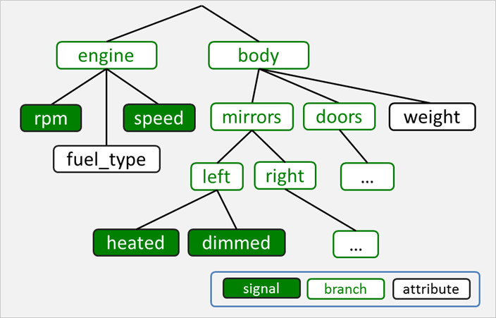

**(C) 2016 Jaguar Land Rover**<br>

All files and artifacts in this repository are licensed under the
provisions of the license provided by the LICENSE file in this repository.

# VEHICLE SIGNAL SPECIFICATION
This repository specifies a set of vehicle signals that can be used in
automotive applications to communicate the state of various vehicle
systems.

A standardized vehicle signal specification allows for an industry actor
to use a common naming space for communicating vehicle state and,
ultimately, allows the decoupling of the IVI stack from the underlying
vehicle electrical architecture.

The collection of signal specifications, or simply signals, is vendor
independent. Vendor-specific extensions can be specified in a dedicated and
uncontrolled branch of the signal specification tree.

The format of the directories and signal specification files is aimed
at allowing easy, git-based management with branching, merging, and
release. With this in mind, the signal specification can be broken up
into smaller files that can be edited and re-used while minimizing
merge conflicts.

A released signal specification can be used, together with tools in
this repository, to automatically generate a number of different
target specification formats, such as JSON, FrancaIDL, etc.

Fig 1 shows the schematics of the top-level process.

<br>
*Fig 1. Generating documents from specification*


The tools are available under the ```tools``` directory.

The release management process will be driven in the context of GENIVI
and its Remote Vehicle Interaction expert group.

# BROWSE JSON VEHICLE SIGNAL SPECIFICATION
A variant of the vehicle signal specification is checked in
as ```vss_$VERSION.json```, where ```$VERSION``` is the content of
the ```VERSION``` file.

A web-based JSON viewer can be used to view the current version.

Click **[here](http://www.jsoneditoronline.org/?url=https://raw.githubusercontent.com/GENIVI/vehicle_signal_specification/develop/vss_rel_1.json)**


# CREATE JSON VEHICLE SIGNAL SPECIFICATION

Make sure that you have the python YAML parser, PyYAML, installed.

## INSTALL PYTHON YAML PARSER
On ubuntu:

    sudo apt-get install python-yaml

On non-ubuntu systems, install from:

    http://pyyaml.org/wiki/PyYAML


## RUN MAKE

    make

The results will be stored in ```vss_$VERSION.[xxx]```,
where ```$VERSION``` is the contents of the ```VERSION``` file and ```xxx``` is
the appropriate file extension for the type of output being produced.  For
example, the JSON version of the output will have a ```.json``` extension.

By default, the ```make``` processor will produce all of the currently
installed output formats.  If only a single format is desired, specify it as
an arguement.  For example, to generate only the json format, type:

    make json

# SIGNAL, BRANCH, AND ATTRIBUTE DEFINITION
Signals, branches, and attributes are organized into a tree such as outlined
in Fig 2.

<br>
*Fig 2. A signal tree example*


## <a name="branch-entry"/>BRANCH ENTRY
A branch is an entity that can host other branches, signals, and attributes.
A branch is identified as an entry with its signal type set to ```branch```.
The only required field for a branch is ```description```.

## <a name="signal-entry"/>SIGNAL ENTRY
A signal is a named entity, such as rpm, that can have a value, such as 3400,
at any given time.

### <a name="signal-type"/>SIGNAL TYPE
Each signal specifies a type from the following set (from FrancaIDL):

Name       | Type                       | Min  | Max
:----------|:---------------------------|:-----|:---
UInt8      | unsigned 8-bit integer     | 0    | 255
Int8       | signed 8-bit integer       | -128 | 127
UInt16     | unsigned 16-bit integer    |  0   | 65535
Int16      | signed 16-bit integer      | -32768 | 32767
UInt32     | unsigned 32-bit integer    | 0 | 4294967295
Int32      | signed 32-bit integer      | -2147483648 | 2147483647
UInt64     | unsigned 64-bit integer    | 0    | 2^64
Int64      | signed 64-bit integer      | -2^63 | 2^63 - 1
Boolean    | boolean value              | 0/false | 1/true
Float      | floating point number      | -3.4e -38 | 3.4e 38
Double     | double precision floating point number | -1.7e -300 | 1.7e 300
String     | character string           | n/a  | n/a
ByteBuffer | buffer of bytes (aka BLOB) | n/a | n/a

Please note that the special type ```branch``` denotes a branch, not a
signal. See the [branch entry](#branch-entry) chapter for details.


### <a name="signal-range"/>SIGNAL RANGE [OPTIONAL]
A signal can optionally be specified with a minimum and maximum limit,
defining the valid range that the signal can assume.

### <a name="signal-enumeration"/>SIGNAL ENUMERATION [OPTIONAL]
A signal can optionally be specified with a set of allowed values that
the signal can be assigned, effectively turning it into an enumerator.  The
values are of the same type as the signal itself.

### <a name="signal-unit-type"/>SIGNAL UNIT TYPE [OPTIONAL]
A signal can optionally specify a unit of measurement from the following set:
TO BE REPLACED BY SI REFERENCE.

Unit type  | Domain        | Description
:----------|:--------------|:-------------
km/h       | Speed         | Kilometers per hour
m/s        | Speed         | Meters per hour
celsius    | Temperature   | Degrees Celsius
mbar       | Pressure      | millibar
pa         | Pressure      | Pascal
kpa        | Pressure      | kilo-Pascal
percent    | Relation      | Percent
ratio      | Relation      | Ratio
lat        | Position      | Decimal latitude
lon        | Position      | Decimal longitude
inch       | Distance      | Inch
mm         | Distance      | Millimeter
m          | Distance      | Meter
km         | Distance      | Kilometer
rpm        | Frequency     | Rotations per minute
hz         | Frequency     | Frequency
W          | Power         | Watt
kW         | Power         | Kilowatt
kwh        | Power         | Kilowatt hours
ms         | Time          | Milliseconds
s          | Time          | Seconds
min        | Time          | Minutes
h          | Time          | Hours
g          | Weight        | Grams
kg         | Weight        | Kilograms
g/s        | Flow          | Grams per second
l/h        | Flow          | Liters per hour
m/s2       | Acceleration  | Acceleration in meters per second squared
cm/s2      | Acceleration  | Acceleration in centimeters per second squared
N          | Force         | Newton
Nm         | Force         | Torque
l          | Volume        | Liter
ml         | Volume        | Milliliter
degree     | Angle         | Angle in degrees
degrees/s  | Angluar Speed | Angular speed in degrees/s
l/100km    | Consumption   | Liters per 100 km
ml/100km   | Consumption   | Milliliters per 100 km
V          | Electrical    | potential difference in volt
A          | Electrical    | current in amperes
... | ... | ...


## <a name="attribute-entry"/>ATTRIBUTE ENTRY
An attribute is an entry, such as vehicle weight or fuel type, with a static
value. The difference between a signal and an attribute is that the signal has
a publisher (or producer) that continuously updates the signal value while an
attribute has a set value, defined in the specification, that never changes.


### <a name="attribute-type"/>ATTRIBUTE TYPE
Each attribute specifies a type in the same way that a signal does.

### <a name="attribute-type"/>ATTRIBUTE VALUE
Each attribute specifies a static value of the correct type.

### <a name="attribute-unit-type"/>ATTRIBUTE UNIT TYPE [OPTIONAL]
An attribute can optionally specify a unit of measurement in the same way that
a signal does.

## SIGNAL NAMING CONVENTION
Signals are named, left-to-right, from the root of the signal tree
toward the signal itself. Each element in the name is delimited with
a period (".") .

For example, the dimming status of the rearview mirror in the cabin is named:

	
    Cabin.RearviewMirror.Dimmed


If there are an array of elements, such as door rows 1-3, they will be
named with an index branch:

```
Cabin.Door.Row1.Left.IsLocked
Cabin.Door.Row1.Left.Window.Position

Cabin.Door.Row2.Left.IsLocked
Cabin.Door.Row2.Left.Window.Position

Cabin.Door.Row3.Left.IsLocked
Cabin.Door.Row3.Left.Window.Position
```

In a similar fashion, seats are located by row and their left-to-right position.

```
Cabin.Seat.Row1.Pos1.IsBelted  # Left front seat
Cabin.Seat.Row1.Pos2.IsBelted  # Right front seat

Cabin.Seat.Row2.Pos1.IsBelted  # Left rear seat
Cabin.Seat.Row2.Pos2.IsBelted  # Middle rear seat
Cabin.Seat.Row2.Pos3.IsBelted  # Right rear seat
```

The exact use of ```PosX``` elements and how they correlate to actual
positions in the car, is dependent on the actual vehicle using the
spec.

## PARENT NODES
If a signal is defined, all parent branches included in its name must
be included as well, as shown below:

```
[Signal] Cabin.Door.Row1.Left.IsLocked
[Branch] Cabin.Door.Row1.Left
[Branch] Cabin.Door.Row1
[Branch] Cabin.Door
[Branch] Cabin
```

The branches do not have to be defined in any specific order as long
as each branch component is defined somewhere in the vspec file (or an
included vspec file).


# SIGNAL SPECIFICATION FORMAT
A signal specification is written as a flat YAML list, where each signal and
branch is a self-contained YAML list element.

The YAML list is a single file, called a *vspec* file.

A vspec can, in addition to a YAML list, also contain include directives.

An include directive refers to another vspec file that is to replace the
directive, much like ```#include``` in C/C++. Please note that, from a YAML
perspective, the include directive is just another comment.

## <a name="branch-entry"/>BRANCH ENTRY
A branch entry describes a tree branch (or node) containing other branches and
signals.

A branch entry example is given below:

```YAML
- Body.Trunk:
  type: branch
  aggregate: true
  description: All signals related to the rear trunk
```

The following elements are defined:

* **```Body.Trunk```**<br>
The list element name defines the dot-notated signal name to the signal.
Please note that all parental branches included in the name must be defined as
well.

* **```type```**<br>
The value ```branch``` specifies that this is a branch entry (as
opposed to a signal entry). This is the default, in case ```type``` is omitted.

* **```aggregate``` [optional]**<br>
Defines whether or not this branch is an aggregate. See
[aggregate branch](#aggregate-branch) chapter for more information.<br>
If not defined, this defaults to ```false```.

* **```description```**<br>
A description string to be included (when applicable) in the various
specification files generated from this branch entry.


## SIGNAL ENTRY
A signal entry defines a single signal and its members. A signal
entry example is given below:

```YAML
- Drivetrain.Transmission.Speed:
	type: Uint16
	unit: km/h
	min: 0
	max: 300
	description: The vehicle speed, as measured by the drivetrain.
```

* **```Drivetrain.Transmission.Speed```**<br>
Defines the dot-notated signal name of the signal. Please note that
all parental branches included in the name must be defined as well.

* **```type```**<br>
The string value of the type specifies the scalar type of the signal
value. See [signal type](#signal-type) chapter for a list of available types.

* **```min``` [optional]**<br>
The minimum value, within the interval of the given ```type```, that the
signal can be assigned.<br>
If omitted, the minimum value will be the "Min" value for the given type.<br>
Cannot be specified if ```enum``` is specified for the same signal entry.

* **```max``` [optional]**<br>
The maximum value, within the interval of the given ```type```, that the
signal can be assigned.<br>
If omitted, the maximum value will be the "Max" value for the given type.<br>
Cannot be specified if ```enum``` is specified for the same signal entry.

* **```unit``` [optional]**<br>
The unit of measurement that the signal has. See [Unit
Type](#signal-unit-type) chapter for a list of available unit types.<br> This
cannot be specified if ```enum``` is specified as the signal type.

* **```description```**<br>
A description string to be included (when applicable) in the various
specification files generated from this signal entry.


## ENUMERATED SIGNAL ENTRY
A signal can optionally be enumerated, allowing it to be assigned a value from a
specified set of values. An example of an enumerated signal is given below:


```YAML
- Chassis.Transmission.Gear:
	type: Uint16,
	enum: [ -1, 1, 2, 3, 4, 5, 6, 7, 8 ]
	description: The selected gear. -1 is reverse.
```

An enumerated signal entry has no ```min```, ```max```, or ```unit```
element.

The ```enum``` element is an array of values, all of which must be specified
in the emum list.  This signal can only be assigned one of the values
specified in the enum list.
The ```type``` specifier is the type of the individual elements of the enum
list.


## SIGNAL ENTRY
A signal entry defines a single signal and its members. A signal
entry example is given below:

```YAML
- Drivetrain.Transmission.Speed:
	type: Uint16
	unit: km/h
	min: 0
	max: 300
	description: The vehicle speed, as measured by the drivetrain.
```

* **```Drivetrain.Transmission.Speed```**<br>
Defines the dot-notated signal name of the signal. Please note that
all parental branches included in the name must be defined as well.

* **```type```**<br>
The string value of the type specifies the scalar type of the signal
value. See [signal type](#signal-type) chapter for a list of available types.

* **```min``` [optional]**<br>
The minimum value, within the interval of the given ```type```, that the
signal can be assigned.<br>
If omitted, the minimum value will be the "Min" value for the given type.<br>
Cannot be specified if ```enum``` is specified for the same signal entry.

* **```max``` [optional]**<br>
The maximum value, within the interval of the given ```type```, that the
signal can be assigned.<br>
If omitted, the maximum value will be the "Max" value for the given type.<br>
Cannot be specified if ```enum``` is specified for the same signal entry.

* **```unit``` [optional]**<br>
The unit of measurement that the signal has. See [Unit
Type](#signal-unit-type) chapter for a list of available unit types.<br> This
cannot be specified if ```enum``` is specified as the signal type.

* **```description```**<br>
A description string to be included (when applicable) in the various
specification files generated from this signal entry.


## <a name="attributes"/>ATTRIBUTES
An attribute is a signal with a default value, specified by
its ```value``` member.

The value set for an attribute by a vspec file can be read by a
consumer without the need of having the value sent out by a
publisher. The attribute, in effect, is configuration data that
can be specified when the vspec file is installed.

Below is an example of a complete attribute describing engine power

```YAML
- MaxPower:
  type:  Uint16
  default: 0
  description: Peak power, in kilowatts, that engine can generate.
```

## <a name="extending"/>EXTENDING AND OVERRIDING SIGNALS
The core signal specification can be extended with additional signals through the
use of private branches, as is shown in Fig 3.


<br>
*Fig 3. Extended signals*

In this case the core signal specification, ```vss_23.vspec``` is
included by a OEM-specific master vspec file that adds the two
proprietary signals ```Private.OEM_X.AntiGravity.Power```
and ```Private.OEM_X.Teleport.TargetLoc```.

Signals can, in a similar manner, be overridden and replaced with a new definition,
as is shown in Fig 4.


<br>
*Fig 4. Overridden signals*

In this case, the ```GearChangeMode``` signal provided by the core
specification lacks an additional semi-automatic mode featured by an
OEM-specific vehicle.

By having an OEM master spec file, ```oem_x_proprietary.vspec```
include the core spec file, ```vss_23.vspec``` and then overriding
the original ```GearChangeMode``` signal and add the ```semi-auto```
element as an enumerated value

## <a name="attributes"/>DECLARING VS. DEFINING ATTRIBUTES
The signal extension mechanism described above is also used to declare
an attribute in one vspec file and define it in another.  This is used
to setup a attribute structure standard in the core specification that
is to be defined on a per-deployment (vehicle) basis.

An example is given in Fig 5.

<br>
*Fig 5. Declaring and defining attributes*

The ```Attributes.Engine.Displacement``` and ```Attributes.Chassis.Weight``` attributes
are declare in the ```vss_23.vspec``` file with a default value of zero.

A project/vehicle specific vspec file, ```oem_x_proprietary.vspec```
then overrides the attributes with the correct values.

## INCLUDE DIRECTIVES

An include directive in a vspec file will read the file it refers to and the
contents of that file will be inserted into the current buffer in place of the
include directive.  The included file will, in its turn, be scanned for
include directives to be replaced, effectively forming a tree of included
files.

See Fig 6 for an example of such a tree.

<br>
*Fig 6. Include directives*


The include directive has the following format:

    #include <filename> [prefix]

The ```<filename>``` part specifies the path, relative to the file with the
```#include``` directive, to the vspec file to replace the directive with.

The optional ```[prefix]``` specifies a branch name to be
prepended to all signal entries in the included file. This allows a vspec file
to be reused multiple times by different files, each file specifying their
own branch to attach the included file to.

An example of an include directive is:

    #include doors.vpsec chassis.doors

The ```door.vspec``` section specifies the file to include.

The ```chassis.doors``` section specifies that all signal entries in
```door.vspec``` should have their names prefixed with ```chassis.doors```.

If an included vspec file has branch or signal specifications that have
already been defined prior to the included file, the new specifications in the
included file will override the previous specifications.


## REUSING SIGNAL TREES
Complete subtrees of signals and attributes can be reused by including
them multiple times, attaching them to different branches each time
they are included.

An example is given in Fig 7 where a generic door signal specification is
included four times to describe all doors in the vehicle.

<br>
*Fig 7. Reusing signal trees*

The ```door.vspec``` file is included four times by the master ```root.vspec``` file.
The signals of ```door.vspec```, ```Locked```, ```WinPos```, and ```Open``` are attached
on the front left and right doors of row 1 (front) and row 2 (back).

If ```door.vspec``` is changed, the changes will be propagated to all four doors.


# SIGNAL ID DATABASES
The tools ```vspec2franca```, ```vspec2json``` and ```vspec2vsi``` can also automatically create signal ID databases, essentially text files, that assign an ID to a particular signal.

To instruct any of the tools to create signal ID databases use the ```-i``` option:

    vspec2json -i <prefix>:<database_file>:<start_id> vspec_file json_file
    
The ```-i``` option can be specified any number of times to created different signal ID databases based on ```<prefix```. Signal IDs are positive integer values.
    
* **```<prefix>```**<br>
Prefix that is matched against signal names. The longest match will be used to determine the signal ID database the signal is stored into. For example, two signal ID databases are specified with ```-i Attribute:vspec_attr.id:0 -i Attribute.Cabin:vspec_attr_cab.id:0```. A signal named ```Attribute.Chassis.Curbweight``` will be stored in ```vspec_attr.id``` while
a signal named ```Attribute.Cabin.Seat.DriverPosition``` will be stored in the ```vspec_attr_cab.id``` database.
* **```<database_file```**<br>
The name of the database file.
* **```<start_id```**<br>
The first ID value for a signal ID database. Note that the ID is only unique for the same database. If you use the ```-i``` option multiple times and would like to have unique IDs across all database files, you need to make sure to specify start IDs for each database so that there is no overlap.

The signal ID databases with their mappings of signal names to ID can be used for easy indexing of signals without the need of providing the entire qualified signal name. However, if vspec files are updated and new signals are added, the existing signal mappings must not change. If database files with mappings already exist, the tools first search them for a signal name and only assign a new signal ID if no existing mapping was found. The signal ID number continues from the highest ID found.

To avoid signal ID conflicts blocks of IDs are reserved as follows:

Block First ID | Block Last ID   | Description
:--------------|:----------------|:---------------------------------
        1      |   999,999       | reserved for standardized signals
1,000,000      | 1,199,999       | reserved for signals to be merged from the development branch
1,200,000      | 1,999,999       | currently unused
2,000,000      | 2,999,999       | private and unpublished signals

Private and unpublished signals are not expected to conflict with each other as it is not deemed to be likely that private signals from different entities are going to be used within the same signal tree.
